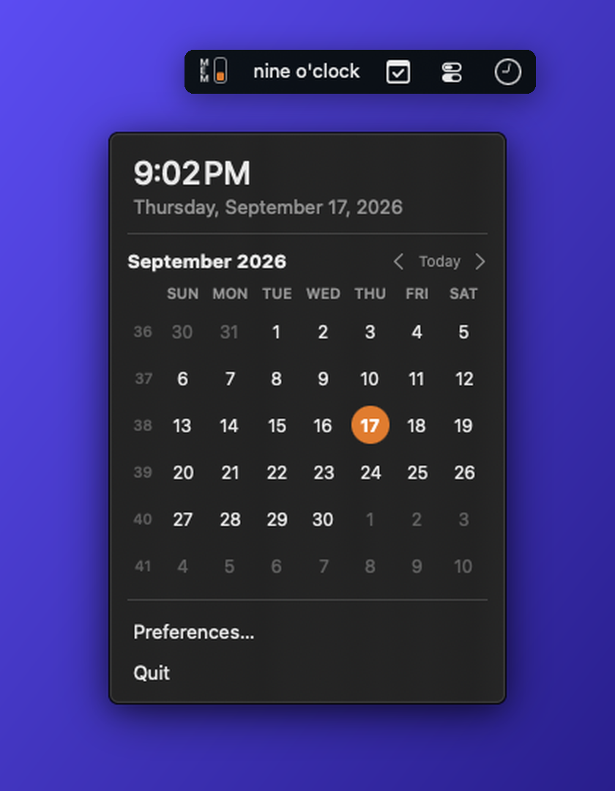

# FuzzyBar

A tiny native macOS menubar clock that tells the time in words.

<p align="center">
  
</p>

Click it for the exact time, today's date, a month calendar, and a couple of
menu items. That's the whole app.

FuzzyBar exists because the fuzzy clock I'd used for years stopped getting
updates and still ran under Rosetta. This one is a few hundred lines of Swift,
builds natively for Apple Silicon, and has no dependencies.

## Features

- Time in words in the menubar, updated when the phrase changes
- Nine personalities, from plain spoken English to Klingon, HAL 9000, and Cthulhu
- Popover with the exact time, full date, and a month calendar with week numbers
- Start at login, via the system Login Items list
- No Dock icon, no network, no analytics, nothing running that doesn't need to

## Requirements

- macOS 14 Sonoma or later
- Xcode 15 or later (command line tools are enough) to build from source

## Build and install

```sh
git clone https://github.com/gkoch02/fuzzybar.git
cd fuzzybar
./build.sh --install
```

That builds a release binary, wraps it in `build/FuzzyBar.app`, copies it to
`/Applications`, and launches it. Run `./build.sh` on its own to build without
installing.

Local builds are ad-hoc signed, which is all you need to run it on your own
Mac. If you have an Apple developer certificate and want a real signature,
point `SIGN_IDENTITY` at it:

```sh
SIGN_IDENTITY="Apple Development: Your Name (TEAMID)" ./build.sh --install
```

No certificates, keys, or notarization credentials are stored in this repo.

There is also an Xcode project, `FuzzyBar.xcodeproj`, generated from `project.yml`
with [XcodeGen](https://github.com/yonaskolb/XcodeGen). It exists for Mac App
Store archives (App Sandbox, automatic signing, the asset-catalog icon) and is
what `docs/APP_STORE.md` walks through. Day-to-day builds and tests still go
through SwiftPM and `build.sh`.

## How the fuzzy time works

Minutes are rounded to the nearest five, then mapped to the usual spoken
phrases: *o'clock*, *five past*, *ten past*, *quarter past*, *twenty past*,
*twenty-five past*, *half past*, and the same again counting down *to* the next
hour. So 8:38 is "twenty to nine" and 8:37 is "twenty-five to nine".

## Personalities

Preferences has a Personality picker. The default is the spoken English above;
the other eight are ported from
[LittleFuzzyClock](https://github.com/gkoch02/LittleFuzzyClock). All shown at
8:40 pm:

| Personality | 8:40 pm reads | Notes |
| --- | --- | --- |
| Spoken (default) | `twenty to nine` | The way you'd say it out loud. |
| Classic | `twenty to nine pm` | Plain English with am and pm; "just after" and "almost" at the edges. |
| Shakespeare | `twenty 'fore nine of the clock` | Archaic English; drops am/pm as anachronistic. |
| Klingon | `twenty 'til Hut rep` | Real tlhIngan Hol numerals; "rep" is Klingon for *hour*. |
| Belter | `twenty to da nine bell, ya` | Lang Belta creole from *The Expanse*; nautical "bell" for time. |
| German | `zwanzig vor neun` | Standard High German; "halb zehn" anchors on the *next* hour. |
| HAL 9000 | `T-20 MINUTES, 2100 HOURS` | Mission-control patter; 24-hour numeric time. |
| Cthulhu | `twenty 'fore, the ninth hour` | Lovecraftian dread; ordinal hours; climaxes with "the stars are right". |
| Latin | `viginti ante hora IX p.m.` | Roman-numeral hours; real Latin prepositions. |

The eight ported personalities share LittleFuzzyClock's twelve-slot table, so
minutes 57 to 59 read "almost [next hour]" rather than flipping to the hour
early the way the spoken default does. The phrase tables live in
`Sources/FuzzyBar/Personality.swift`.

The logic lives in `Sources/FuzzyBar/FuzzyTime.swift` and is covered by tests:

```sh
swift test
python3 -m unittest discover -s Tests/BuildScriptTests
```

Tests cover all daily phrase boundaries in every personality, calendar grids, clock scheduling, login
approval states, and build-script failure handling.

## Project layout

| Path | What it is |
| --- | --- |
| `Sources/FuzzyBar/FuzzyBarApp.swift` | App entry point and the menubar popover |
| `Sources/FuzzyBar/FuzzyTime.swift` | Time-to-words conversion |
| `Sources/FuzzyBar/Personality.swift` | The nine phrasing personalities |
| `Sources/FuzzyBar/Clock.swift` | Phrase-boundary ticker (minute updates while the popover is open) |
| `Sources/FuzzyBar/CalendarView.swift` | Month grid |
| `Sources/FuzzyBar/SettingsView.swift` | Preferences window |
| `Assets/` | Icon renderer and the generated `.icns` |
| `Resources/` | Asset catalog (app icon) and the privacy manifest for the Xcode build |
| `build.sh` | Builds, signs, and optionally installs the app bundle |
| `project.yml`, `FuzzyBar.xcodeproj` | XcodeGen spec and the generated project for App Store archives |
| `FuzzyBar.entitlements`, `ExportOptions.plist` | App Sandbox entitlement and `xcodebuild -exportArchive` options |
| `docs/APP_STORE.md` | Mac App Store submission playbook and listing copy |

## Regenerating the icon

The app icon is drawn in code. Edit `Assets/make_icon.swift` and run:

```sh
./Assets/make_icns.sh
```

That rewrites both `Assets/AppIcon.icns` (used by `build.sh`) and the PNG set in
`Resources/Assets.xcassets` (used by the Xcode project).

## License

MIT. See [LICENSE](LICENSE).
