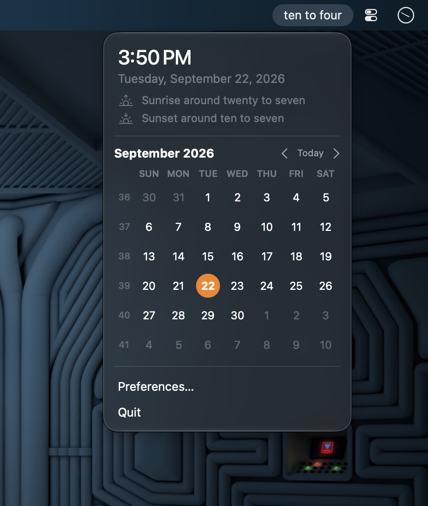
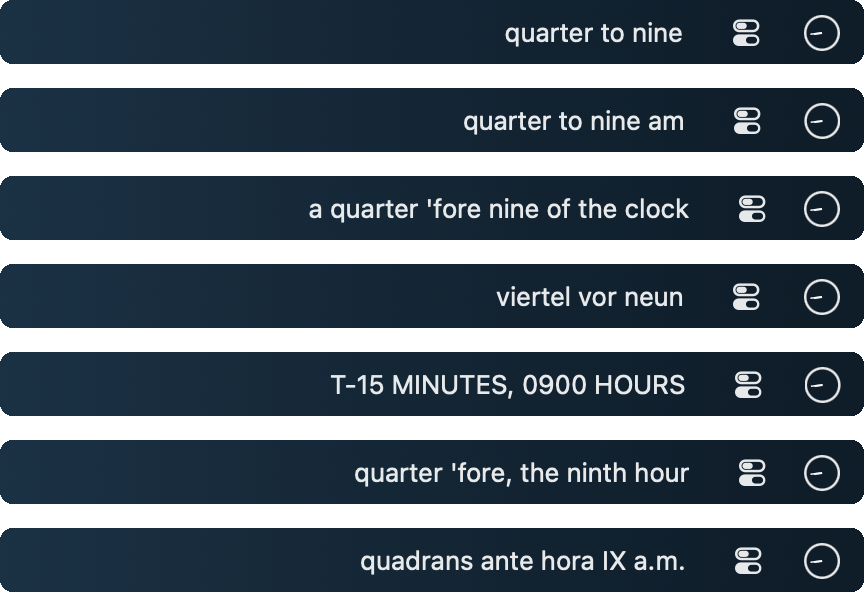

# FuzzyBar

A tiny native macOS menubar clock that tells the time in words.

<p align="center">
  
</p>

Click it for the exact time, today's date, a month calendar, and a couple of
menu items. That's the whole app.

**[Get it on the Mac App Store](https://apps.apple.com/us/app/id6813746171)** for
$0.99, a signed universal build the store installs and keeps updated, or build it
yourself for free from this repository (below). It's the same app either way.

FuzzyBar exists because the fuzzy clock I'd used for years stopped getting
updates and still ran under Rosetta. This one is a few hundred lines of Swift,
builds natively for Apple Silicon, and has no dependencies.

## Features

- Time in words in the menubar, updated when the phrase changes
- Seven personalities, from plain spoken English to Mission Control and Eldritch
- Popover with the exact time, full date, and a month calendar with week numbers
- Start at login, via the system Login Items list
- Today's sunrise and sunset in the popover, without asking for your location
- No Dock icon, no network, no analytics, nothing running that doesn't need to

## Requirements

- macOS 14 Sonoma or later
- Xcode 15 or later (command line tools are enough) to build from source; the
  [Mac App Store](https://apps.apple.com/us/app/id6813746171) build needs nothing else

## Build and install

```sh
git clone https://github.com/gkoch02/fuzzybar.git
cd fuzzybar
./build.sh --install
```

That builds a release binary, wraps it in `build/FuzzyBar.app`, copies it to
`/Applications`, and launches it. Run `./build.sh` on its own to build without
installing.

Local builds are ad-hoc signed, which is all you need to run it on your own
Mac. If you have an Apple developer certificate and want a real signature,
point `SIGN_IDENTITY` at it:

```sh
SIGN_IDENTITY="Apple Development: Your Name (TEAMID)" ./build.sh --install
```

No certificates, keys, or notarization credentials are stored in this repo.

There is also an Xcode project, `FuzzyBar.xcodeproj`, generated from `project.yml`
with [XcodeGen](https://github.com/yonaskolb/XcodeGen). It exists for Mac App
Store archives (App Sandbox, automatic signing, the asset-catalog icon).
Day-to-day builds and tests still go through SwiftPM and `build.sh`.

## How the fuzzy time works

Minutes are rounded to the nearest five, then mapped to the usual spoken
phrases: *o'clock*, *five past*, *ten past*, *quarter past*, *twenty past*,
*twenty-five past*, *half past*, and the same again counting down *to* the next
hour. So 8:38 is "twenty to nine" and 8:37 is "twenty-five to nine".

## Sunrise and sunset

The popover shows today's sunrise and sunset, fuzzily ("sunset around ten to
seven"), because the location behind them is a guess. FuzzyBar has no location
access and doesn't ask for any: it uses the reference city of the Mac's time
zone, so a Mac set to America/New_York gets New York's sun. Preferences can
switch that to typed-in coordinates, or hide the two lines. At midnight sun or
polar night the popover says the sun doesn't set or doesn't rise today.

The arithmetic is NOAA's simplified solar-position equations, ported from
LittleFuzzyClock and good to a minute or two. The zone-to-city table, and
the old names that still point at a city (US/Eastern, Asia/Calcutta), are
generated from an IANA tzdata release's `zone.tab` and `backward` by
`Tools/make_zone_locations.py` and compiled in; the script's docstring has the
download steps.

## Personalities

Preferences has a Personality picker. The default is the spoken English above;
the other six are ported from
[LittleFuzzyClock](https://github.com/gkoch02/LittleFuzzyClock). All shown at
8:40 pm:

| Personality | 8:40 pm reads | Notes |
| --- | --- | --- |
| Spoken (default) | `twenty to nine` | The way you'd say it out loud. |
| Classic | `twenty to nine pm` | Plain English with am and pm; "just after" and "almost" at the edges. |
| Shakespeare | `twenty 'fore nine of the clock` | Archaic English; drops am/pm as anachronistic. |
| German | `zwanzig vor neun` | Standard High German; "halb zehn" anchors on the *next* hour. |
| Mission Control | `T-20 MINUTES, 2100 HOURS` | Mission-control patter; 24-hour numeric time. |
| Eldritch | `twenty 'fore, the ninth hour` | Cosmic dread; ordinal hours; climaxes with "the stars are right". |
| Latin | `viginti ante hora IX p.m.` | Roman-numeral hours; real Latin prepositions. |

<p align="center">
  
</p>

All seven are in that stack, shot in one sitting with the rest of the menubar
hidden, so the difference between any two rows is the personality and nothing
else. The table above is 8:40 pm because that is what Preferences previews;
the strips are 8:44 am because that is when they were taken.

There were nine until the store submission, and four of them carried
franchise names. HAL 9000 and Cthulhu had borrowed only the label, so they
kept their phrase tables and became Mission Control and Eldritch. Klingon and
Belter had gone further: their phrases were tlhIngan Hol numerals and Lang
Belta particles, which is the language itself rather than a nod to it, and
renaming them would have kept the exposure while hiding the tell. Both are
withdrawn. A preference file naming one of the renamed two migrates on first
launch; one naming a withdrawn personality falls back to Spoken.

The six ported personalities share LittleFuzzyClock's twelve-slot table, so
minutes 57 to 59 read "almost [next hour]" rather than flipping to the hour
early the way the spoken default does. The phrase tables live in
`Sources/FuzzyBar/Personality.swift`.

The logic lives in `Sources/FuzzyBar/FuzzyTime.swift` and is covered by tests:

```sh
swift test
python3 -m unittest discover -s Tests/BuildScriptTests
```

Tests cover all daily phrase boundaries in every personality, calendar grids, clock scheduling, login
approval states, and build-script failure handling.

## Project layout

| Path | What it is |
| --- | --- |
| `Sources/FuzzyBar/FuzzyBarApp.swift` | App entry point and the menubar popover |
| `Sources/FuzzyBar/FuzzyTime.swift` | Time-to-words conversion |
| `Sources/FuzzyBar/Personality.swift` | The seven phrasing personalities |
| `Sources/FuzzyBar/Clock.swift` | Phrase-boundary ticker (minute updates while the popover is open) |
| `Sources/FuzzyBar/CalendarView.swift` | Month grid |
| `Sources/FuzzyBar/Sun.swift`, `SunSettings.swift`, `SunView.swift` | Sunrise and sunset: the equations, the location setting, the popover lines |
| `Sources/FuzzyBar/ZoneLocations.swift` | Time zone reference cities, generated by `Tools/make_zone_locations.py` |
| `Sources/FuzzyBar/SettingsView.swift` | Preferences window |
| `Assets/` | Icon renderer, the generated `.icns`, and the store screenshots (raws plus captioned set) |
| `Tools/make_screenshots.py` | Renders the captioned screenshots from the raws |
| `Resources/` | Asset catalog (app icon) and the privacy manifest for the Xcode build |
| `build.sh` | Builds, signs, and optionally installs the app bundle |
| `project.yml`, `FuzzyBar.xcodeproj` | XcodeGen spec and the generated project for App Store archives |
| `FuzzyBar.entitlements` | App Sandbox entitlement |

## Regenerating the icon

The app icon is drawn in code. Edit `Assets/make_icon.swift` and run:

```sh
./Assets/make_icns.sh
```

That rewrites both `Assets/AppIcon.icns` (used by `build.sh`) and the PNG set in
`Resources/Assets.xcassets` (used by the Xcode project).

## License

MIT. See [LICENSE](LICENSE).
